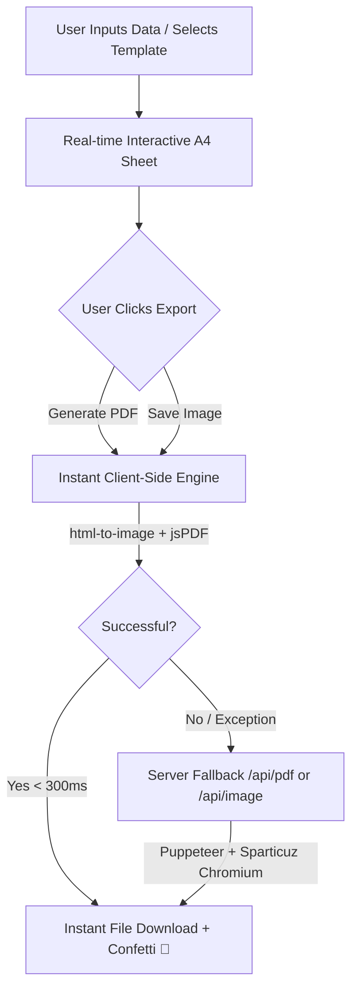

# 📄 Metropolitan University (MU) Cover Page Generator

<div align="center">

[](https://mu-cover-page-generator.vercel.app/)
[](https://react.dev/)
[](https://vitejs.dev/)
[](https://tailwindcss.com/)
[](LICENSE)

<p align="center">
  <b>A modern, high-performance, and beautifully crafted A4 Cover Page Generator for Metropolitan University students.</b><br>
  Create professional Assignment and Lab Report cover pages in seconds with real-time preview, multiple templates, and instant client-side PDF/PNG exports.
</p>

[**🚀 Explore Live Demo**](https://mu-cover-page-generator.vercel.app/) • [**🐛 Report Bug**](https://github.com/Nafiz-365/Cover-Page-Generator/issues) • [**💡 Request Feature**](https://github.com/Nafiz-365/Cover-Page-Generator/issues)

</div>

---

## 🌟 Overview

Creating formatted cover pages for academic assignments and lab reports is often tedious, time-consuming, and prone to formatting inconsistencies across different word processors.

**MU Cover Page Generator** eliminates this friction. It provides a real-time, pixel-perfect A4 canvas with dynamic auto-formatting, official university typography and branding, course memory autocompletion, and dual-engine instant export capability — tailored specifically for the departments and academic guidelines of **Metropolitan University, Sylhet**.

---

## ✨ Key Features

### ⚡ Ultra-Fast Client-Side Exports (< 300ms)
- **Instant PDF Generation:** Uses vectorized DOM-to-canvas rendering (`html-to-image` + `jsPDF`) directly inside the browser. No server waiting, no network latency.
- **High-Resolution PNG:** One-click instant image downloads with print-grade crispness.
- **Dual Engine Architecture:** Intelligent client-side primary export with automatic, seamless fallback to a headless Chromium (Puppeteer) server API if required.
- **Adaptive Resolution:** Automatic device-aware pixel ratio scaling (1.8x on mobile for zero GPU lag; 2.0x+ on desktop for razor-sharp 300 DPI print quality).

### 🎨 8 Academic Templates & Custom Theming
- **Templates Included:**
  - `Classic`: The official, standard academic university layout.
  - `Minimal`: Clean, modern whitespace-focused design.
  - `Modern`: Contemporary accent-line header design.
  - `Bordered`: Traditional academic certificate-style frame.
  - `Tech`: Geometric header motif designed for CS & Engineering.
  - `Thesis`: Formal double-bordered layout for research reports.
  - `Card UI`: Contemporary floating card-styled metadata blocks.
  - `Side Stripe`: Polished corporate and business report style.
- **Curated Typography:** Choose from 8 academic fonts (Inter, Poppins, Merriweather, Roboto Mono, Open Sans, Montserrat, Playfair Display, Oswald).
- **Color Accent Engine:** Preset color palettes + interactive color picker with real-time preview updating.
- **Dark / Light Mode:** Native toggle with eye-friendly high-contrast dark theme.

### 🧠 Smart Student Utilities & Automation
- **Assignment vs Lab Mode:** One-tap toggle between Assignment (Topic, Assignment No) and Lab Report (Experiment Name, Lab Report No).
- **Course Code Memory:** Type `CSE-300` and the generator automatically remembers and suggests the associated Course Title.
- **Smart Title Casing:** Automatically capitalizes names, topics, and titles on input blur.
- **Local Persistence:** Form data, custom presets, selected themes, and templates auto-save to `localStorage`.
- **Preset Library:** Save customized presets for different courses, teachers, and semesters for one-click re-use.
- **Click-to-Edit Preview:** Clicking any section on the live A4 preview immediately scrolls to and highlights the relevant input field in the sidebar.
- **Custom University Logo:** Supports uploading custom institutional logos with local caching.
- **Interactive Canvas Toolbar:** Zoom in, zoom out, 100% actual size, and auto-fit to screen.

---

## 🏗️ Architecture



---

## 🛠️ Tech Stack

| Domain | Technologies |
|---|---|
| **Frontend Core** | [React 19](https://react.dev/), [Vite 8](https://vitejs.dev/), ES Modules |
| **Styling & UI** | [Tailwind CSS v4](https://tailwindcss.com/), CSS Custom Properties, Glassmorphism |
| **Icons & Effects** | [Lucide React](https://lucide.dev/), [Canvas Confetti](https://www.npmjs.com/package/canvas-confetti) |
| **Client Export Engine** | [html-to-image](https://github.com/bubkoo/html-to-image), [jsPDF](https://github.com/parallax/jsPDF) |
| **Server Engine** | [Node.js](https://nodejs.org/), [Express 5](https://expressjs.com/), [Puppeteer](https://pptr.dev/) |
| **Serverless Headless** | [@sparticuz/chromium](https://github.com/Sparticuz/chromium) (Vercel Serverless Functions) |
| **Deployment** | [Vercel](https://vercel.com/) |

---

## 🚀 Getting Started

Follow these instructions to run the project locally on your machine.

### Prerequisites

- [Node.js](https://nodejs.org/) (version 18.0 or higher recommended)
- [npm](https://www.npmjs.com/) (bundled with Node.js)

### Installation

1. **Clone the repository:**
   ```bash
   git clone https://github.com/Nafiz-365/Cover-Page-Generator.git
   cd MU-Cover-Page-Generator
   ```

2. **Install dependencies:**
   ```bash
   npm install
   ```

### Running Locally

To run both the **Vite Frontend dev server** and the **Express Backend API** concurrently:

```bash
npm run dev:all
```

- **Frontend Client:** [http://localhost:5173](http://localhost:5173)
- **Backend API:** [http://localhost:3000](http://localhost:3000)

Alternatively, you can run services individually:

- **Frontend only:** `npm run dev`
- **Backend only:** `npm run server`
- **Production preview:** `npm run start`

---

## 📦 Project Structure

```text
MU-Cover-Page-Generator/
├── api/                    # Vercel Serverless Function endpoints
│   ├── pdf.js              # Serverless PDF generation via Chromium
│   ├── image.js            # Serverless Image generation
│   └── templateBuilder.js  # Server-side HTML template renderer
├── public/                 # Static assets
│   ├── assets/             # Logos, icons, and university branding
│   └── manifest.json       # PWA web manifest
├── server/                 # Local Node.js Express server
│   └── server.js           # Development Express app with Puppeteer
├── src/                    # Application source code
│   ├── components/         # React modular components
│   │   ├── form/           # Sidebar, input groups, presets, color picker
│   │   ├── layout/         # Header, navigation, layout containers
│   │   ├── preview/        # Live A4 page renderer, zoom controls
│   │   └── ui/             # Toast alerts, modals, common primitives
│   ├── constants/          # Department lists, templates, typography options
│   ├── context/            # CoverPageContext state management
│   ├── utils/              # exportUtils (instant client-side export engine)
│   ├── App.jsx             # Root layout and split pane container
│   ├── index.css           # Global stylesheet & design tokens
│   └── main.jsx            # React application entry point
├── index.html              # HTML entry with asynchronous font preloading
├── vite.config.mjs         # Vite build configuration & code-splitting
└── package.json            # Scripts & project dependencies
```

---

## ⚡ Performance Optimizations

- **Non-Blocking Font Preloading:** Google Fonts stylesheets are loaded asynchronously with `media="print" onload="this.media='all'"` to eliminate render blocking during initial page loads and reloads.
- **Route & Vendor Code-Splitting:** Heavy export utilities (`jsPDF`, `html-to-image`) are isolated from the initial bundle and preloaded in background idle time (`requestIdleCallback`).
- **Mobile Off-screen Preservation:** Mobile tabs keep the `#capture-area` live and computed in the DOM off-screen, ensuring instant downloads without layout jumps.
- **Adaptive Memory Management:** Automatic pixel-ratio throttling prevents GPU canvas crashes on mobile browsers while maintaining high resolution on desktop.

---

## 🤝 Contributing

Contributions, bug reports, and feature suggestions are welcome!

1. Fork the repository (`https://github.com/Nafiz-365/Cover-Page-Generator/fork`)
2. Create your feature branch (`git checkout -b feature/AmazingFeature`)
3. Commit your changes (`git commit -m 'Add some AmazingFeature'`)
4. Push to the branch (`git push origin feature/AmazingFeature`)
5. Open a Pull Request

---

## 📜 License

Distributed under the **ISC License**. See `LICENSE` for more information.

---

## 👨‍💻 Author

**Nafiz Kamal Talha**
- **GitHub:** [@Nafiz-365](https://github.com/Nafiz-365)
- **Project Link:** [https://github.com/Nafiz-365/Cover-Page-Generator](https://github.com/Nafiz-365/Cover-Page-Generator)
- **Live Demo:** [https://mu-cover-page-generator.vercel.app/](https://mu-cover-page-generator.vercel.app/)

---

<div align="center">
  <sub>Built with ❤️ for the students of Metropolitan University, Sylhet.</sub>
</div>
